class: center

```{r, out.width='35%', echo=FALSE}
#knitr::include_graphics(c('images/gif_serie.gif'))
```


<br>


# Predicción de robos mediante un enfoque espaciotemporal

<br>

```{r, echo=FALSE, out.width='15%', out.height='15%', fig.align='center'}

```

<br>
Rafael Zambrano

Octubre 2022

---


```{r setup, include=FALSE}
knitr::opts_chunk$set(warning = FALSE, 
                      message = FALSE, 
                      comment=FALSE)
```


```{r, echo=FALSE}
library(tidyverse)
library(gt)
library(rlang)
library(tidymodels)

rmsle_vec <- function(truth, estimate, na_rm = TRUE, ...) {
  rmsle_impl <- function(truth, estimate) {
    sqrt(mean((log(truth + 1) - log(estimate + 1))^2))
  }
  
  metric_vec_template(
    metric_impl = rmsle_impl,
    truth = truth,
    estimate = estimate,
    na_rm = na_rm,
    cls = "numeric",
    ...
  )
}

rmsle <- function(data, ...) {
  UseMethod("rmsle")
}
rmsle <- new_numeric_metric(rmsle, direction = "minimize")

rmsle.data.frame <- function(data, truth, estimate, na_rm = TRUE, ...) {
  metric_summarizer(
    metric_nm = "rmsle",
    metric_fn = rmsle_vec,
    data = data,
    truth = !!enquo(truth),
    estimate = !!enquo(estimate),
    na_rm = na_rm,
    ...
  )
}
```


```{r, echo=FALSE}
xaringanExtra::use_panelset()
options(scipen=999, digits=2)
```


```{css, echo=FALSE}
/* Table width = 100% max-width */
.remark-slide table{width: 100%;}
/* Change the background color to white for shaded rows (even rows) */
.remark-slide thead, .remark-slide tr:nth-child(2n) {
  background-color: white;
  .tfoot .td {background-color: white}
}
.bold-last-item > ul > li:last-of-type,
.bold-last-item > ol > li:last-of-type {font-weight: bold;}
```


```{r, include=FALSE, warning=FALSE}
xaringanExtra::use_progress_bar(color = "#0051BA", location = "top")
```

# Expositor

.pull-left[
### Rafael Zambrano
- **Actuary / Data Scientist**
]
.pull-right[
<br>
<br>
```{r, out.width='35%', fig.align='center', echo=FALSE}

```
]

---

# Agenda

#### ✅ Caso de uso
#### ✅ Datos
#### ✅ Modelado
#### ✅ Resultados

---
class: chapter-slide

# Caso de Uso

---

# Caso de Uso

.pull-left[

<br>
<br>
<br>
<br>
<br>
<br>

```{r, out.width='70%', fig.align='center', echo=FALSE}

```
]

.pull-right[

<br>


- **Predicción de robos** sobre las esquinas de la Ciudad de Buenos Aires. 

- Combinación de factores **temporales y esapciales** relacionados con la ocurrencia del robo. 

- Modelado **espaciotemporal** de la ocrrencia de robos.

- Enfoque de series de tiempo y de datos de corte transversal.

- Uso intensivo del ecosistema **{tidymodels}** y sus extensiones.


]

---

class: chapter-slide

# Datos

---

# Datos

### Fuentes de datos

* El repositorio de datps del Gobierno de la Ciudad Autónoma de Buenos Aires **([link](https://data.buenosaires.gob.ar/dataset/))**,es la principal y única fuente de datos, desde este lugar se extraen los datos referentes a robos ocurridos, factores meteorológicos y elementos físicos del entorno cercano a la ocurrencia de robos.


---

# Datos

### Esquinas de la ciudad

* El punto de partida para el conteo de delitos por esquinas y la agregación de variables de entorno físico, reside en la geolocalización obtenida de las esquinas de la ciudad. 

* Se obtiene un objeto geoespacial con todas las calles y avenidas de CABA, las mismas se almacenan como polígonos.

* La intersección de estos polígonos permite extraer las esquinas del objeto espacial de la ciudad, para posteriormente utilizarlas como unidades de captura del delito.

---

# Datos

### Esquinas de la ciudad

Los objetos geoespaciales se obtienen a través del paquete {osmdata} 📦. A continuación, se muestran los polígonos de las principales calles y avenidas de CABA.


```{r, out.width='50%', fig.align='center', echo=FALSE}
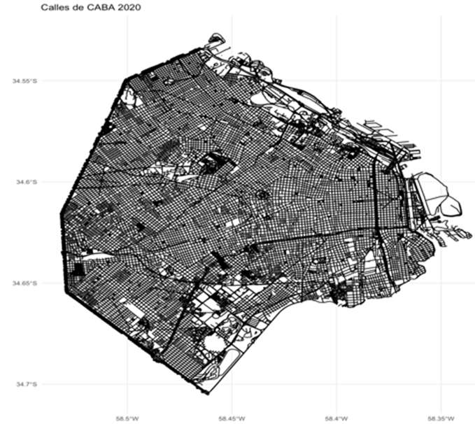
```


---

# Datos

### Esquinas de la ciudad

* Mediante la intercepción de las calles y avenidas se obtienen 22.048 esquinas.

* Se debe seleccionar un número de esquinas óptimas a utilizar, para evitar incluir esquinas que estén muy cercanas entre sí.

* Se seleccionan las esquinas que estén a una distancia de más de 300 metros entre sí, mediante un filtro de proximidad geoespacial a través del paquete {rangeBuilder} 📦.


---

# Datos

### Esquinas de la ciudad


```{r, fig.align='center', echo=FALSE}
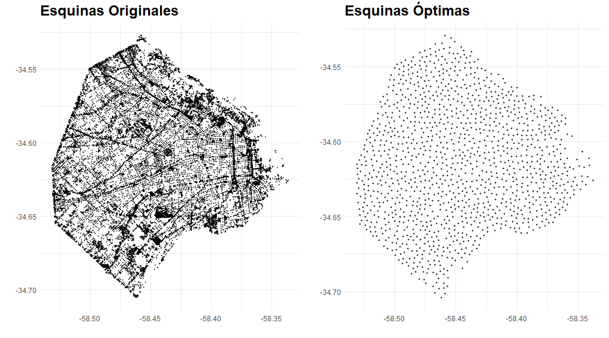
```


---


# Datos

### Recuento Histórico de delitos

* Los datos tienen una estructura tabular, se almacena para cada delito la fecha y ubicación de ocurrencia a través de la latitud y longitud.

* Esto permite geolocalizar el delito y posteriormente agregar factores de entorno cercano a su ocurrencia.

* El enfoque implementado tiene como objetivo la predicción de ocurrencia de robos, la clasificación de los tipos de delitos no se contempla.

---

# Datos

### Recuento Histórico de delitos

* El periodo de estudio inicia en diciembre del año 2017 y culmina en febrero del año 2020, se estudiaron en total 147.250 delitos.

* A continuación, se presenta la distribución geográfica de la criminalidad sobre el mapa de CABA, desde diciembre del 2019 hasta el fin del periodo.


```{r, out.width='65%', fig.align='center', echo=FALSE}
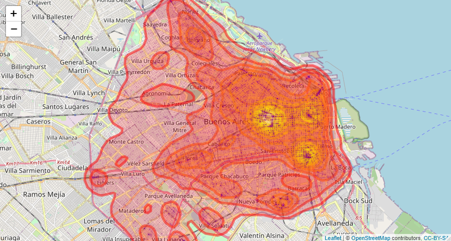
```

---

# Datos

### Recuento Histórico de delitos

#### Asociación de robos con esquinas

* Se procede a calcular el número de robos ocurridos dentro de
un radio de 200 metros para cada esquina en cada uno de los meses analizados. 

* 111.157 robos tienen asociada una esquina  

* Las esquinas presentan 28 meses de observación, pero no en todos los meses registran delitos ocurridos, se excluyen aquellas esquinas que no registraron delitos en ningún mes. 

---

# Datos

### Recuento Histórico de delitos

#### Asociación de robos con esquinas

```{r , echo=FALSE,  out.width='55%', fig.align='center', out.height='55%'}
delitos_def_4 <- readRDS("data/delitos_def.rds")

delitos_def_4$meses_con_delitos %>% 
  table() %>% 
  as.data.frame() %>% 
  ggplot(aes(x=., y=Freq)) +
  geom_segment( aes(x=., xend=., y=0, yend=Freq)) +
  geom_point(size=4, color="red", alpha=0.7, shape=21, stroke=2) +
  theme_minimal() +
  labs(x = "Meses con delitos", y = "Número de esquinas") +
  scale_color_grey()
```


---

# Datos

### Variables Espaciales

* Mediante elementos espaciales, se busca recrear el entorno físico cercano a la ocurrencia del robo.

* Se procede a calcular el número de elementos de entorno cercano a cada una de las esquinas mediante un radio de metros definido.

* Algunos elementos considerados: puntos de wifi públicos, estaciones de transporte público, comisarías, centros de salud, centros educativos, entre otros.

---

# Datos

### Variables Temporales

* Se agregaron factores meteorológicos, estos se vinculan mediante la fecha de ocurrencia de los robos.

* Estos factores varían únicamente en función de la fecha, ya que todas las esquinas se ubican en la misma ciudad.

* Los factores hacen referencia a la temperatura promedio mensual, las precipitaciones acumuladas en milímetros de agua, los días acumulados en el mes con precipitaciones y la velocidad máxima promedio del viento para cada mes.


---

# Datos

### Construcción del Dataset

* El paso final para la construcción del dataset definitivo, consiste en la implementación de la técnica de **“ventana deslizante”**, esta tecnica fue operacilaizada en el paquete {sknifedatar} 📦.


```{r, out.width='80%', fig.align='center', echo=FALSE}
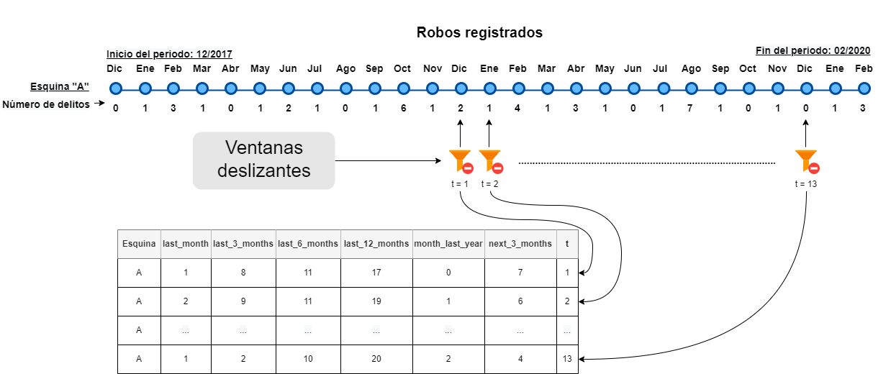
```


---

# Datos

### Dataset Final

* El conjunto de datos definitivo para iniciar la etapa de modelado cuenta con **50 columnas y 16.198 observaciones**.

* Cada observación hace referencia a una esquina vista desde un mes determinado, las columnas agrupan las variables de entorno, clima y el historial de delitos ocurridos.

```{r, echo=FALSE}
Data_set_modelos <- readRDS("data/Data_set_modelos.rds")
```


```{r}
dataset <- Data_set_modelos %>% filter(pliegue >= 12)

dataset %>% head() %>% rmarkdown::paged_table(list(rows.print = 6))
```


---

class: chapter-slide

# Modelado

---

# Modelado

### Enfoque de Series de Tiempo

* El enfoque de series temporales corresponde al modelo base de mínimo rendimiento. 

* Para cada una de las esquinas se procede a utilizar el recuento histórico de robos desde diciembre del 2017 hasta noviembre del 2019.

* El objetivo reside en predecir la ocurrencia de delitos desde diciembre del 2019 hasta febrero del 2020, en adelante ambos se denominan periodos de entrenamiento y validación respectivamente.

---

# Modelado

### Enfoque de Series de Tiempo

* Se implementa un modelo ingenuo, donde se establece como predicción lo ocurrido en el último trimestre en el periodo de entrenamiento.

* Se utilizan modelos ARIMA y Croston.

* Este último modelo es un caso especial de regresiones de conteo para series intermitentes, comportamiento evidente de muchas de las esquinas que se modelan.

```{r, out.width='45%', fig.align='center', echo=FALSE}
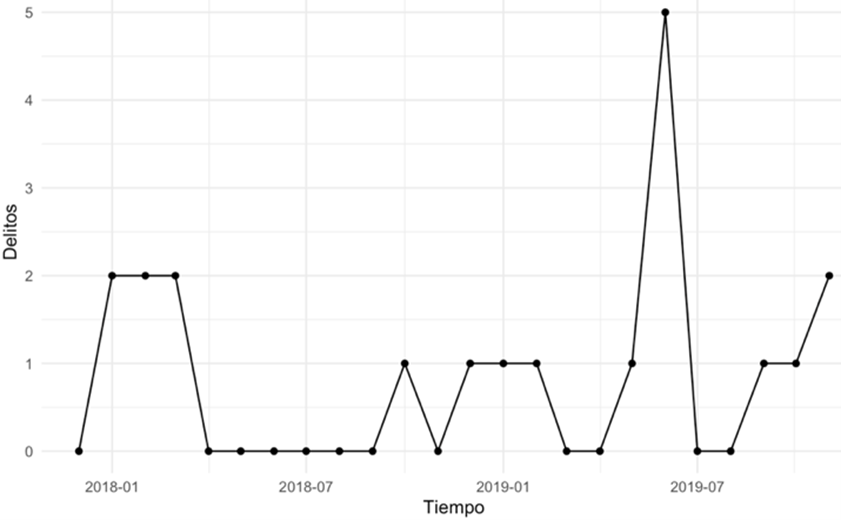
```

---

# Modelado

### Enfoque de Series de Tiempo

* No todas las series presentan el problema de intermitencia, por lo tanto, se propone combinar la implementación del modelo Croston con modelos ARIMA.

* Se selecciona al mejor modelo que se ajuste a cada esquina.de tiempo. Esta metodología de ajuste de múltiples modelos sobre múltiples series de tiempo, se implementó mediante el paquete {sknifedatar}📦.

```{r, out.width='90%', fig.align='center', echo=FALSE}
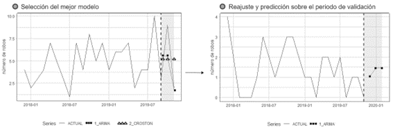
```

---

# Modelado

### Enfoque de Corte Transversal

* La implementación de modelos de aprendizaje automático consiste en modelar de manera conjunta los factores temporales y espaciales.

* La estrategia de validación se fundamenta en la metodología de ventanas deslizantes, siendo “n” el último valor de “t” que para cada esquina corresponde al conjunto de datos de validación. 

* Para todas las esquinas, el resto de los meses constituyen los datos de entrenamiento, por lo tanto, se busca predecir lo ocurrido en los últimos 3 meses de estudio en función de lo ocurrido en los meses anteriores.

---

# Modelado

### Enfoque de Corte Transversal

```{r, eval=FALSE}
train <- dataset %>% filter(pliegue != 24)

test <- dataset %>% filter(pliegue == 24)
```


```{r, fig.align='center', echo=FALSE}
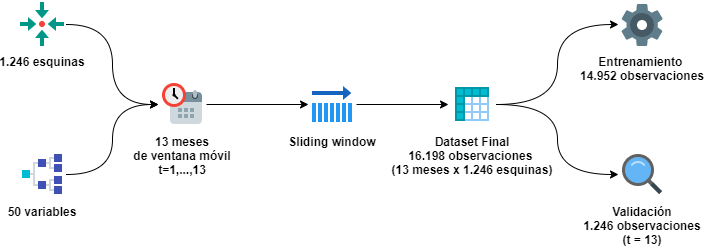
```

---

# Modelado

### Enfoque de Corte Transversal

* En este estudio no hace falta realizar una partición aleatoria en datos de entrenamiento y validación, debido a que ambos conjuntos de datos se obtienen a través de las fechas. 

* Se implementa el modelo Extreme Gradient Boosting (XGBoost), realizando el ajuste de hiperparámetros a través de una optimización bayesiana.

---

# Modelado

### Validación Cruzada Espacial

* Para los datos geoespaciales del presente estudio, está latente la existencia de autocorrelación espacial en las esquinas de CABA, esto violaría el supuesto de independencia entre las observaciones de entrenamiento y evaluación.

* Para mitigar la posible influencia de la autocorrelación espacial, se implementa una técnica de validación cruzada espacial, generando particiones mediante agrupamientos de k-medias.

---

# Modelado

* **Validación Cruzada**

```{r, out.width='60%', fig.align='center', echo=FALSE}
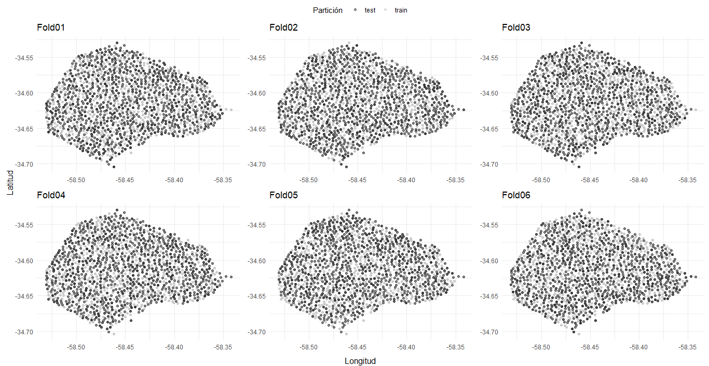
```

* **Validación Cruzada Espacial**
```{r, out.width='60%', fig.align='center', echo=FALSE}
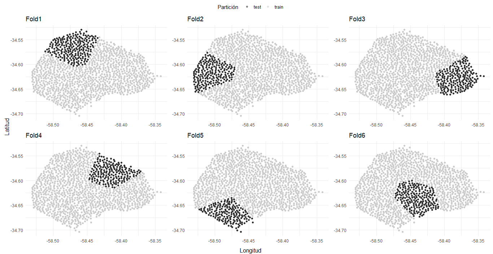
```

---

# Modelado

### Validación Cruzada Espacial

* La validación cruzada espacial fue desarrollada mediante el paquete **{spatialsample}**📦, perteneciente al ecosistema {tidymodels}📦.

* Vale destacar que todo el desarrollo de modelado se realizó mediante los distintos paquetes de {tidymodels}.

```{r, out.width='30%', fig.align='center', echo=FALSE}
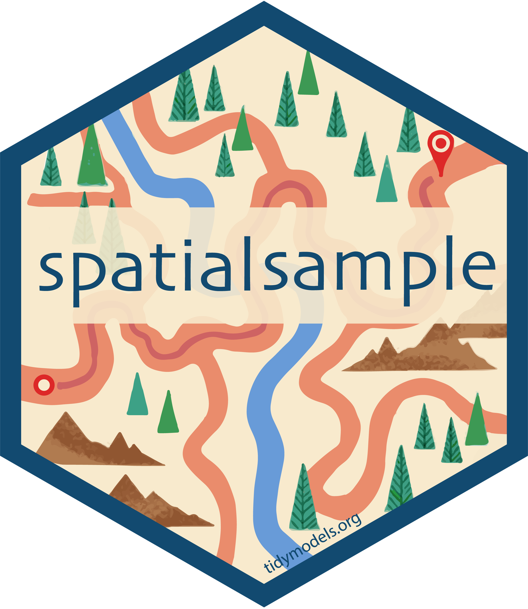
```

---

class: chapter-slide

# Resultados

---

# Resultados

### Métricas

* Para todos los modelos se observa el error cuadrático medio (RMSE) y el error absoluto medio (MAE), ambas métricas se muestran de forma habitual en el proceso de evaluación de modelos.

* Se incluye tambien el error logarítmico cuadrático medio (RMSLE).

* Se incluyen otro grupo de métricas complementarias, sin embargo, se mostrarán únicamente las 3 mencionadas anteriormente.


---

# Resultados

### Modelos de series de tiempo

* Se implementa un modelo ingenuo, modelos ARIMA mediante la técnica de Auto-ARIMA.

* Finalmente se implementa un modelo híbrido donde compiten los modelos ARIMA y Croston, seleccionando el mejor para cada serie según el error porcentual medio arcotangente (MAAPE).


```{r, echo=FALSE}
tabla_ts <- readRDS("data/tabla_ts.rds")

tabla_ts %>% relocate(modelo, mae) %>% gt() %>% fmt_number(2:4,decimals = 3)
```

---

# Resultados

### Modelos de aprendizaje automático

* Se implementa un modelo XGBoost que incluye únicamente las variables delictivas rezagadas, denominado en las tablas de métricas  como “XGBoost robos”.

* Posteriormente, se realiza la comparación con un XGBoost que contempla todos los factores temporales y espaciales, denominado “XGBoost all”.

* Ambos modelos se ajustan y evalúan mediante validación cruzada estándar y espacial, verificando si existe alguna influencia relacionada con la autocorrelación espacial.


---

# Resultados

### Modelos de aprendizaje automático

* **XGBoost all** 

```{r, out.width='50%', fig.align='center', echo=FALSE}
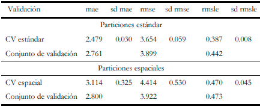
```


* **XGBoos robos**

```{r, out.width='50%', fig.align='center', echo=FALSE}
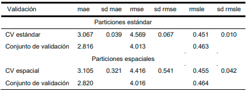
```

---

# Conclusiones

* La incorporación de los factores temporales y del entorno físico, contribuyeron a generar mejores predicciones, siendo evidente al observar el rendimiento inferior de los modelos que únicamente toman en cuenta el historial de robos ocurridos. 

* Aunque el modelo “XGBoost robos” también mostró un rendimiento superior a los modelos de series de tiempo, no permite verificar las contribuciones de factores espaciales existentes.

* Las variables rezagadas referentes a la ocurrencia de robos resultaron ser las más importantes, sin embargo, variables relacionadas con el transporte público, centros educativos, locales gastronómicos y hoteles, también muestran contribuciones importantes en las predicciones.


---

## Contactos ✉

* **Rafael Zambrano** [](https://twitter.com/rafa_zamr) [](https://www.linkedin.com/in/rafael-zambrano/) [](https://github.com/rafzamb) [](https://rafael-zambrano-blog-ds.netlify.app/)


* **Articulo**: "UN ENFOQUE ESPACIOTEMPORAL PARA LA PREDICCIÓN DE DELITOS EN LA CIUDAD DE BUENOS AIRES", **([link](http://www.economicas.uba.ar/wp-content/uploads/2016/04/Zambrano-Rafael-1.pdf))**

* **Presentación** **([link](https://rafzamb.github.io/sknifedatar/))**

---

class: chapter-slide

# Muchas Gracias!!!
